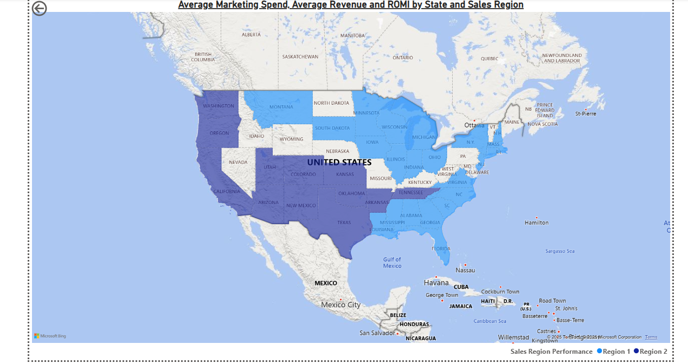

# 📊 Startup Expansion Strategy Dashboard

## 🧠 Project Overview
This dashboard was created as part of a Business Intelligence course project simulating a real-world challenge: advising a growing startup, We Wash You Sleep, on its regional performance and new market opportunities.

The company had recently opened stores in 10 new U.S. cities and wanted to know:

1. Which sales region was performing more efficiently

2. Which new cities should receive additional marketing investment

3. Where expansion efforts are most likely to succeed

The result is a Power BI dashboard that empowers stakeholders to make data-driven decisions about marketing allocation and growth strategy.

## 📁 The Data Behind the Dashboard
To build this dashboard, I worked with two key datasets that captured both store performance and demographic context:

1. Store Performance Data
📄 StartupExpansion.xlsx

This file contains sales and marketing data for each store run by We Wash You Sleep, a laundry pickup service. Key fields included:

a. Store ID – Unique identifier for each store

b. City & State – Store location

c. Sales Region – Classified as Region 1 or Region 2

d. New Expansion – Indicates whether the store is part of the company’s recent expansion

e. Marketing Spend – Total marketing budget per store

f. Revenue – Total revenue generated

This dataset allowed me to calculate and compare average revenue, average marketing spend, and ROMI (Return on Marketing Investment) across regions and cities.

2. City Demographic Data
📄 US-Cities-Population.csv

This file provided geographic and demographic insights to support market potential analysis, including:

a. City & State – For merging with store data

b. 2015 Population Estimate – Used to size market potential

c. Population Change (2010–2015) – A proxy for growth trends

d. Land Area & Population Density – Helped understand urban spread

e. Geolocation Coordinates – Enabled geographic visualization

This combination of business and population data enabled a richer, more contextual analysis.

## 📈 Dashboard Highlights
⚙️ Technical Implementation
The dashboard integrates both business performance and demographic data, offering stakeholders an interactive tool for exploration and decision-making.

Key Features:
📐 Custom DAX Measures for:

-Average Revenue

-Average Marketing Spend

-ROMI (Revenue ÷ Marketing Spend)

📊 Visualizations:

-Region-level comparisons via bar charts

-Top 10 new cities analysis based on ROMI, revenue, and population

-Map visual showing store locations

-Filters and slicers by region, city, and expansion status

🧩 Interactivity:

-Users can filter results by city or region

-Dynamic updates across visuals for easier exploration

🔁 Data Preparation:

-Cleaned and joined Excel and CSV files in Power BI

-Standardized location fields for merging

-Handled missing data in population and marketing fields

## 💡 Key Insights Delivered
1. Region 2 outperformed Region 1 in terms of marketing efficiency. Despite slightly lower average marketing spend, Region 2 achieved a higher ROMI of 2.8, compared to Region 1’s 2.1—delivering more revenue per dollar spent.

2. Among the 10 new cities, San Bernardino, CA and Spokane, WA emerged as top performers, with above-average revenue and efficient marketing. These cities present strong opportunities for increased investment.

3. Cities like St. Petersburg, FL, with populations exceeding 250,000, showed a strong relationship between market size and ROI. The sweet spot appears to be mid-sized cities (150K–300K)—large enough to scale but small enough to avoid high competition.

These findings helped shape a targeted strategy for sustainable expansion into underserved U.S. cities.

## ⚙️ Tools Used
Power BI Desktop, DAX, Excel, CSV

## 📸 Sample Visuals

