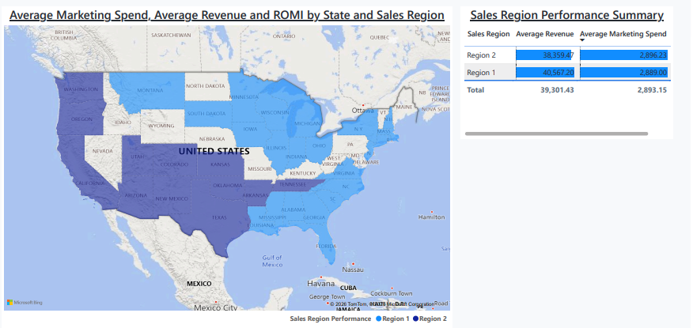

# Startup Expansion Strategy Dashboard — Power BI

A Power BI dashboard advising a growing startup, *We Wash You Sleep*, on regional performance and new market opportunities across 10 recently opened U.S. city locations — combining store sales data with city demographics to guide marketing investment.

**Author:** Faith Kangogo &nbsp;&nbsp; **Tools:** Power BI Desktop · DAX · Excel · CSV

## Skills Demonstrated

- Power BI data modelling (joining business + demographic datasets)
- Custom DAX measures (ROMI, average revenue, average marketing spend)
- Interactive report design (slicers, cross-filtering, map visuals)
- Data cleaning and standardisation across sources
- Translating analysis into an expansion strategy

---

## Business Question

The company opened stores in 10 new U.S. cities and needed to know:

1. Which sales region is performing more efficiently?
2. Which new cities should receive additional marketing investment?
3. Where are expansion efforts most likely to succeed?

## Data

| Dataset | Contents |
| --- | --- |
| `StartupExpansion.xlsx` | Per-store sales region, expansion status, marketing spend, and revenue |
| `US-Cities-Population.csv` | City population estimates, growth (2010–2015), density, and coordinates |

The two sources were cleaned and joined in Power BI on standardised city/state fields, with missing population and marketing values handled during preparation.

## Approach

1. **Data preparation** — cleaned and merged the Excel and CSV sources, standardised location fields.
2. **DAX measures** — built Average Revenue, Average Marketing Spend, and **ROMI** (Revenue ÷ Marketing Spend).
3. **Report design** — region-level bar chart comparisons, a top-10 new cities analysis, a store location map, and slicers by region, city, and expansion status.

---

## Key Findings

### 1. Region 2 spends less but earns more per marketing dollar

Region 2 achieved a **ROMI of 2.8 vs Region 1's 2.1**, despite slightly lower average marketing spend — the clearest signal of where marketing efficiency lives.

### 2. San Bernardino, CA and Spokane, WA are the standout new cities

Both combined above-average revenue with efficient marketing spend, making them the strongest candidates for increased investment.

### 3. Mid-sized cities are the expansion sweet spot

Cities in the **150K–300K population range** showed the best balance: large enough to scale, small enough to avoid heavy competition.

## Dashboard Preview

📄 The full report is available as a PDF: [View the dashboard export](h24faika.pdf)

## Repository Contents

| File | Description |
| --- | --- |
| `h24faika.pbix` | Power BI report file (open in Power BI Desktop) |
| `h24faika.pdf` | PDF export of the full dashboard |
| `StartupExpansion.xlsx` | Store performance dataset |
| `US-Cities-Population.csv` | City demographic dataset |
| `image.png` | Dashboard screenshot |

## How to Explore

1. Install [Power BI Desktop](https://powerbi.microsoft.com/desktop/) (free).
2. Download and open `h24faika.pbix`.
3. Use the slicers to filter by region, city, or expansion status — all visuals update dynamically.

No Power BI? The PDF export shows the complete dashboard.

## Possible Extensions

- Add time-series data to track ROMI trends after marketing changes.
- Score candidate cities with a weighted expansion index (population growth × ROMI potential).
- Publish to Power BI Service for shareable, browser-based access.
